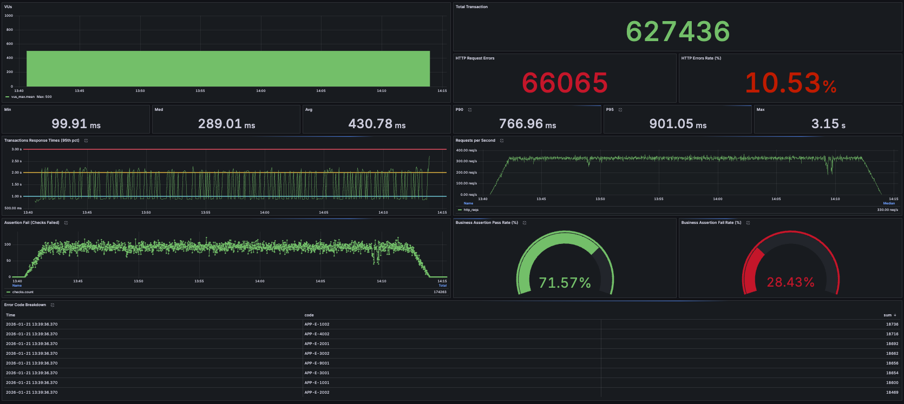

# k6 Load Testing Dashboard (InfluxDB v1.x)

Grafana dashboard for visualizing **k6 load test results** using **InfluxDB 1.x (InfluxQL)**.

This dashboard is designed for users running **k6 with InfluxDB v1.x**, and has been **tested with InfluxDB 1.7.4**.

---

## 📊 Metrics Included

* HTTP Request Duration (Avg / P95 / P99)
* Requests per Second (RPS)
* Error Rate
* Iterations
* Virtual Users (using `vus_max`)
* Data Received / Sent

---

## 🧱 Requirements

* k6
* InfluxDB **1.7.x – 1.8.x**
* Grafana **8+**
* Query Language: **InfluxQL**

> ⚠️ **Not compatible with InfluxDB 2.x (Flux)**

---

## 🚀 How to Use

### 1. Run k6 with InfluxDB output

```bash
k6 run --out influxdb=http://localhost:8086/k6 script.js
```

### 2. Configure InfluxDB Data Source in Grafana

* URL: `http://localhost:8086`
* Database: `k6`
* Query Language: **InfluxQL**

### 3. Import Dashboard

1. Grafana → **+ Import**
2. Upload `dashboards/k6-load-testing-dashboard.json`
3. Select your InfluxDB data source
4. Import 🎉

---

## ℹ️ Notes

### InfluxDB Version

* This dashboard uses **InfluxQL**
* It relies on the **InfluxDB 1.x schema**
* It will **not work with InfluxDB 2.x** without major changes

### Virtual Users Metric

k6 does not always emit a real-time `vus` metric in InfluxDB.

This dashboard uses:

* `vus_max` — the maximum number of virtual users allocated during the test

This ensures compatibility with most k6 executors.

---

## 📷 Screenshot



---

## 📝 License

MIT
